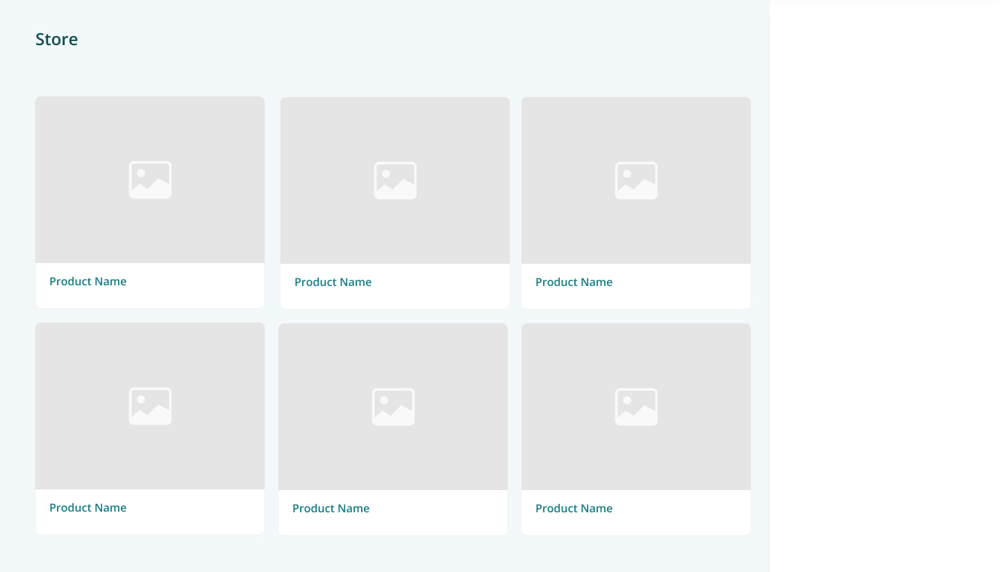
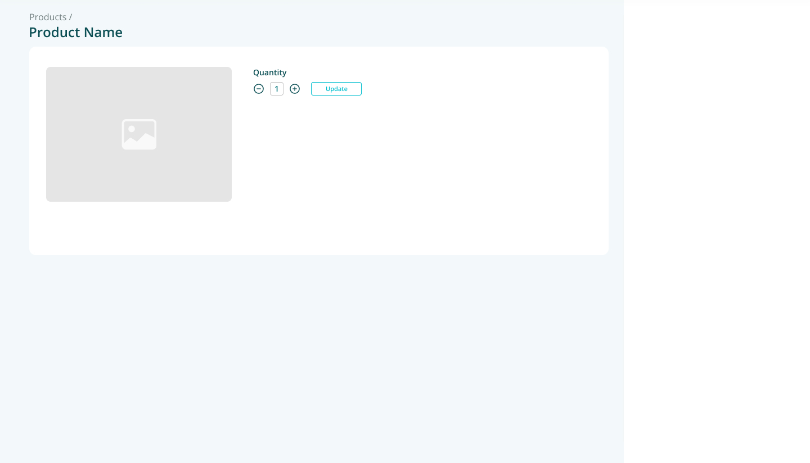
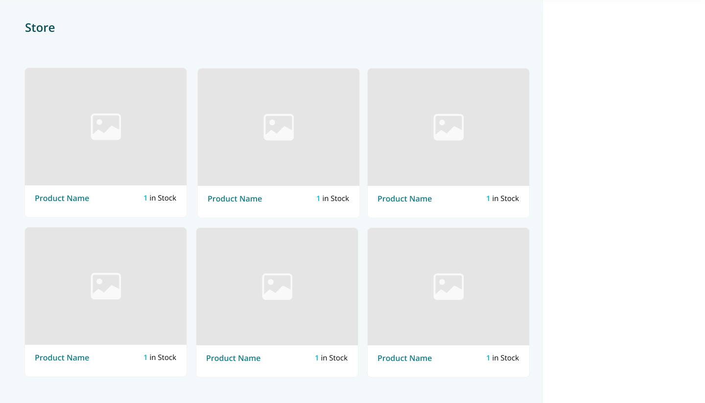
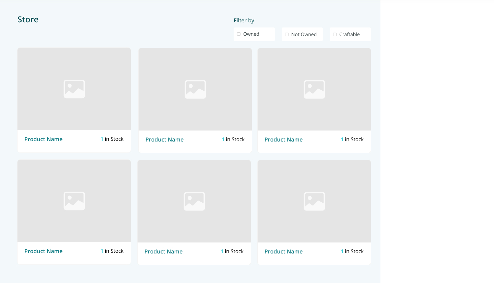
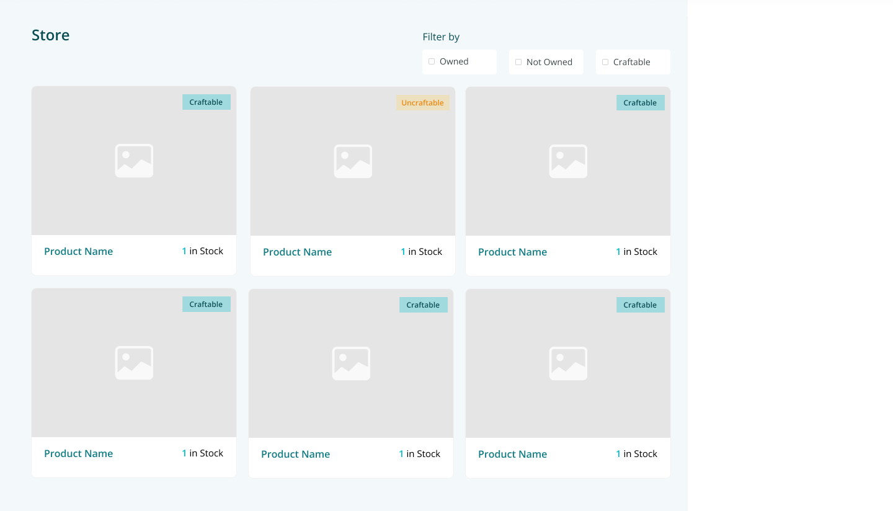
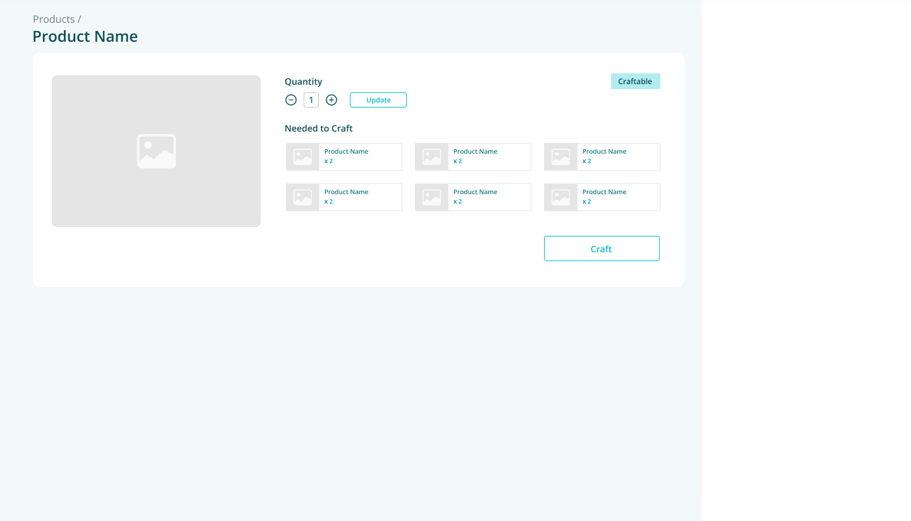
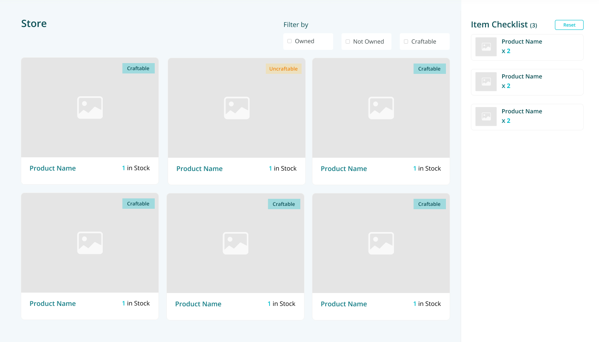
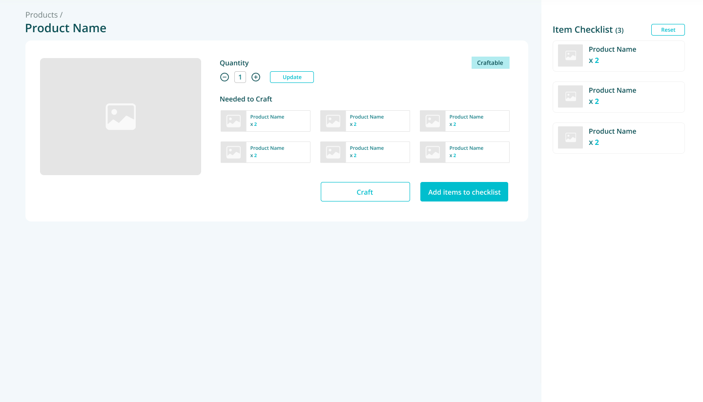

# Frontend Developer Technical Test

Using this project as a base, write an application to manage an inventory. There are products, filters, an iten checklist, and interactions between all three.

## Exercise

Go through the following steps to complete the exercise. Try to be close to the expected interfaces (visually and functionally). You can make decisions (visual or technical); if you do, we’ll ask you to explain **why**.

To review this exercise, we’ll look at: the interfaces, your code, and your Git history.

*It does not need to be perfect but should represent your ability. If you feel stuck, send us the link to your repository. Don’t waste your time working for free on a problem you might not be able to solve.*

Good luck!

### Step 1: Show products

One page should display the products. Show them in a collection of product cards, a.k.a.: a grid. Each card should have the **picture** and the **name** of the product.

Data are provided by an API: `/api/products`

### Step 2: Interact with products

When the user selects a product, he should be able to access  a **form** to indicate how many copies of this product he has. 

The product card will display the **quantity** of the product currently **in stock**.

*This project does not handle database; the API only provides hardcoded data and doesn’t support mutations. This is a Frontend Developer test, we don’t ask you to use databases or improve the API. However, the user should be able to **recover his information** when coming back.*

### Step 3: Filter products

Add an option to **filter** the product collection. The user should be able to filter by:

- only the products he currently has
- only the products he doesn’t have
- only the products he can craft

*Some products can be crafted from other products. The API provides, for each product, a list of materials needed to craft it. When the material list is empty, the product is a basic product that can be bought directly. (see also the following steps for more context)*

### Step 4: Craft products

Some products can be crafted from other products. When the user selects “craftable” products, he should be able to click on a button to craft them:

- the quantity of selected products should be increased
- the quantity of materials should be decreased

The product should be automatically deselected after crafting.

### Step 5: Shop/Loot for materials

Create an item checklist showing:

- the name of the product
- the quantity needed
- a checkbox to let the user indicates he bought the product

When the user selects “uncraftable” products, he should be able to click on a button to add their materials to the item checklist:

- items should be merged in the list; if it is needed in several products, the total quantity should be summed from its parts
- only basic products (products without materials) can be added to the item checklist

When a product is checked, the quantity should be automatically added to the stock and the product should disappear from the list

## Getting started with the project

This is a [Next.js](https://nextjs.org/) project bootstrapped with [`create-next-app`](https://github.com/vercel/next.js/tree/canary/packages/create-next-app). 

It’s also a GitHub template project. Click on “Use this template” button to create your own project. Then clone it locally to start working.

1. Install the deps `yarn install`.
2. Start the development server `yarn dev`.
3. Open [http://localhost:3000](http://localhost:3000/) with your browser to see the result.

You can start editing the page by modifying `pages/index.tsx`. The page auto-updates as you edit the file.

[API routes](https://nextjs.org/docs/api-routes/introduction) can be accessed on [http://localhost:3000/api/products](http://localhost:3000/api/products). This endpoint can be edited in `pages/api/products.ts`.

The `pages/api` directory is mapped to `/api/*`. Files in this directory are treated as [API routes](https://nextjs.org/docs/api-routes/introduction) instead of React pages.
